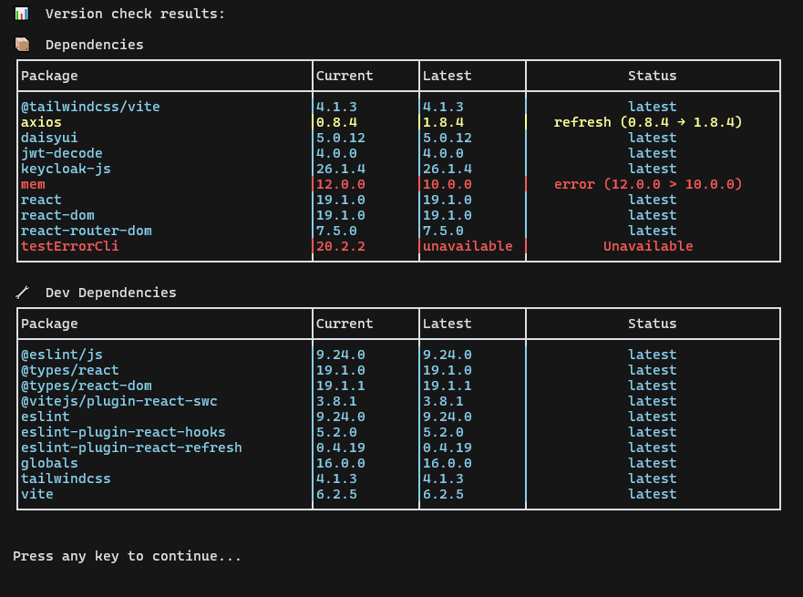
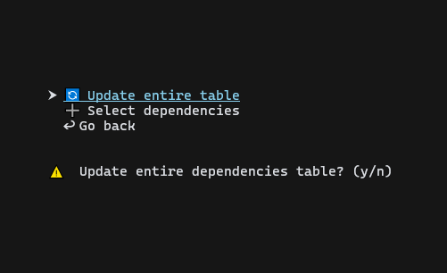
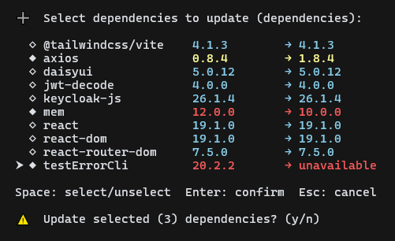

```
██████╗  ██╗   ██╗ ██████╗
██╔══██╗ ██║   ██║ ██╔══██╗
██║  ██║ ╚██╗ ██╔╝ ██████╔╝
██║  ██║  ╚████╔╝  ██╔═══╝
██████╔╝   ╚██╔╝   ██║
╚═════╝     ╚═╝    ╚═╝
```

# 🪐 DVP ( Dependency Version Patrol )

**DVP** (Dependency Version Patrol) — is a CLI-tool that helps you monitor and manage the versions of dependencies in your project by using the `package.json` file for your project. It features a stylish interface, easy navigation, and all the necessary functions for controlling dependencies.

&nbsp;

> [!NOTE]
> ### 💻 Interface:
> - This is what the DVP main menu looks like.


&nbsp;

## 🔥 Main features:

> [!NOTE]
> ### 👁️‍🗨️ Version control:
> - Comparison of current versions with the latest versions from the npm registry.



&nbsp;

> [!NOTE]
> ### 🔁 Updating dependencies:
> - Mass or selective updates.

 

&nbsp;

> [!NOTE]
> ### 💾 Backup + ⚡ **caching**:
> - Creating backups of the package file.json via the main menu.
> - Speeding up repeat checks.

```sh
✅  Backup created:

📁  D:\your_project\DVP_backups\package_2025-04-05_05-03-20.json
```

&nbsp;

> [!WARNING]
> ### Requirements:
> - version __`Node.js ≥ 14.0.0`__.
> - Performance and usability have improved due to the use of [__`Windows Terminal`__](https://apps.microsoft.com/detail/9N0DX20HK701?hl=ru-ru&gl=RU&ocid=pdpshare).

> [!CAUTION]
> - Do not use this menu option: `🔄 Update all dependencies` ⚠️ **Bug!**<br/>
> This will create duplicate dependencies between all tables!
> - Characters such as **`~`**, **`^`** will be removed during the update process.

&nbsp;

## 🛠 Installation:

1. Clone the **`DVP`** repository to any folder:
```sh
git clone https://github.com/Furiozi/DVP.git
```

2. Move the **`DVP.cjs`** file into the project's directory, along with the `package.json`.

```sh
📁 Project
├── 📄 package.json
└── 📄 DVP.cjs
```

> [!TIP]
> 3.  Add script:
> ```json 
> "scripts": {
>   "cli": "node DVP.cjs",
> },
> ```

&nbsp;

## 🚀 Application:

Execute the script using Node.js:

```sh
node DVP.cjs
```
&nbsp;

## 📜 License

### This project is licensed under the Apache License 2.0 - see the [LICENSE](LICENSE) file for details.

&nbsp;

## 👨‍💻 Author

### Developed by **Furiozi**

&nbsp;

## 💖 Support

### If you find this tool to be helpful, please consider giving it a rating of ⭐ on [GitHub](https://github.com/Furiozi/DVP)!